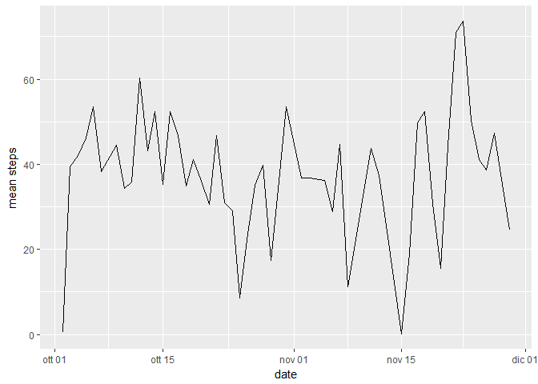
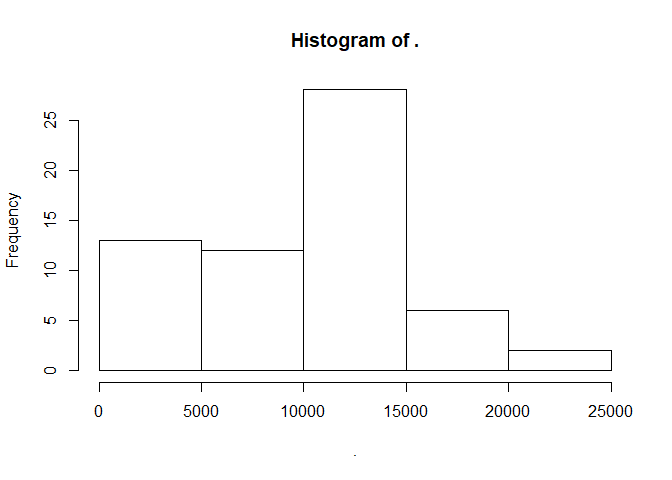
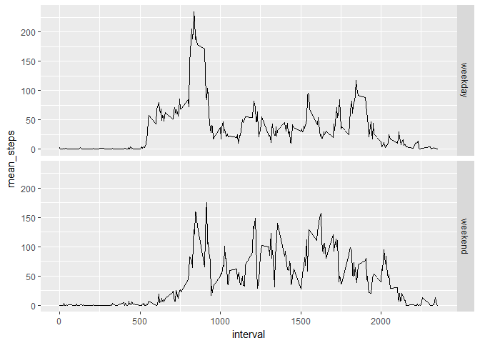
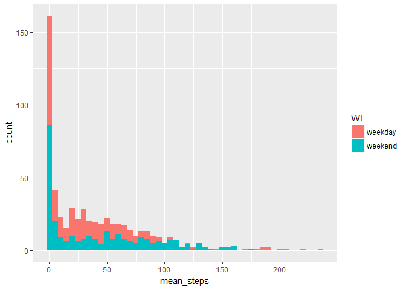

I first clean the Global Environment and set up the markdown page

I create a directory where I can download the data

    print("Hello, this is my version")

    ## [1] "Hello, this is my version"

    print(version)

    ##                _                           
    ## platform       x86_64-w64-mingw32          
    ## arch           x86_64                      
    ## os             mingw32                     
    ## system         x86_64, mingw32             
    ## status                                     
    ## major          3                           
    ## minor          4.4                         
    ## year           2018                        
    ## month          03                          
    ## day            15                          
    ## svn rev        74408                       
    ## language       R                           
    ## version.string R version 3.4.4 (2018-03-15)
    ## nickname       Someone to Lean On

    #create dir
    if(!file.exists("data")) {
            dir.create("data")
    }

I download the data from the link

    url<-"https://d396qusza40orc.cloudfront.net/repdata%2Fdata%2Factivity.zip"
    if(!file.exists("data.zip")) {
            download.file(url,destfile="data.zip")
            dateDownloaded<-date()
            print(dateDownloaded)
    }

I unzip and open the data

    mydir<-getwd()
    print(mydir)

    ## [1] "F:/CasaUfficio/R notes/Reproduceable Research"

    if(!file.exists("data.zip")) {
            unzip("data.zip", exdir=paste(mydir,"/data",sep=""))  
    }
    activities<-read.csv(paste(mydir,"/data/activity.csv",sep=""))
    activities$date<-as.Date(as.character(activities$date))

I load the needed packages

    library(dplyr)

    ## 
    ## Attaching package: 'dplyr'

    ## The following objects are masked from 'package:stats':
    ## 
    ##     filter, lag

    ## The following objects are masked from 'package:base':
    ## 
    ##     intersect, setdiff, setequal, union

    library(ggplot2)

Request: Histogram of the total number of steps taken each day
Observations: the distribution is positive asymmetric, the bulk of the
steps taken per day is between 10K and 15K, which is around 7 and 10
kilometers per day. I presume this user isn't exactly always home..

    activities %>% group_by(date) %>% 
            summarise("total steps"=sum(steps,na.rm = TRUE)) %>% 
            select("total steps") %>% pull() %>% hist()

Request:Mean and median number of steps taken each day

Observations: median is always back of the mean, confirming the
skewnewss of the distribution of the steps. Median steps are often zero,
this reads that in those days the user is still (sleeping, laying or
sat) for most of the day (+50% of the time).

    activities %>% group_by(date) %>% 
            summarise("mean steps"=mean(steps,na.rm = TRUE),
                      "median steps"=median(steps,na.rm = TRUE))

    ## # A tibble: 61 x 3
    ##    date       `mean steps` `median steps`
    ##    <date>            <dbl>          <dbl>
    ##  1 2012-10-01      NaN                NA 
    ##  2 2012-10-02        0.438             0.
    ##  3 2012-10-03       39.4               0.
    ##  4 2012-10-04       42.1               0.
    ##  5 2012-10-05       46.2               0.
    ##  6 2012-10-06       53.5               0.
    ##  7 2012-10-07       38.2               0.
    ##  8 2012-10-08      NaN                NA 
    ##  9 2012-10-09       44.5               0.
    ## 10 2012-10-10       34.4               0.
    ## # ... with 51 more rows

Request:Time series plot of the average number of steps taken

Observations: means per day reflect the different totals in number of
steps taken per day: some days like in late november the user was very
active, while on some other day the user seems to have not taken a
single step out of bed (or most likely he forgot his smartwatch at home)

    avgstepsbyday<-activities %>% group_by(date) %>% 
            summarise("mean steps"=mean(steps,na.rm = TRUE)) %>% 
            filter(!is.nan(`mean steps`))
    ggplot(avgstepsbyday,aes(date,`mean steps`))+geom_line()

Request: The 5-minute interval that, on average, contains the maximum
number of steps

Observations: the interval in which the user takes more steps is no.
835.When dividing it by 60 one gets 13.9, which-supposing the intervals
start their numbering at midnight- corresponds to a peak in activity
some time before 2pm, that might be in his lunchbreak.

    avgstepsbyinterval<-activities %>% group_by(interval) %>% 
            summarise(mean_steps=mean(steps,na.rm = TRUE)) 
    maxstepinterval<-avgstepsbyinterval %>% filter(mean_steps==max(mean_steps)) 
    maxstepinterval

    ## # A tibble: 1 x 2
    ##   interval mean_steps
    ##      <int>      <dbl>
    ## 1      835       206.

Request: Code to describe and show a strategy for imputing missing data

Explanation: I chose to impute NAs to the median number of steps taken
for the corresponding interval.

    activitiesNAi<-activities 
    for (i in unique(activities$interval)) {
      activitiesNAi$steps[is.na(activitiesNAi$steps) & activities$interval==i]<-
        activities %>% filter(interval==i) %>% select(steps) %>% pull() %>%
        median(steps,na.rm = T)   
      }

Request:Histogram of the total number of steps taken each day after
missing values are imputed

Observation: given the choice of imputing missing to the medians, is all
but strange that the prominence of the central bin was confirmed and
reinforced

    activitiesNAi %>% group_by(date) %>% 
            summarise("total steps"=sum(steps,na.rm = TRUE)) %>% 
            select("total steps") %>% pull() %>% hist()

Request:Panel plot comparing the average number of steps taken per
5-minute interval across weekdays and weekends

Observation: I created two different panel, one that highlights the
dynamics through the day of respectively the weekday and the weekend,
and another that highlights the distribution of "step-intensity" of the
intervals again in both weekdays and weeends. What emerges is a higher
mobility in weekends and a "more rigid" pattern of peaks of activity and
still-intervals during weekdays. This is likely associated with a job
that involves a mostly constant "routine" during weekdays than in
weekends.

    activitiesWE<-activities %>% mutate(weekdays=weekdays(date))
    activitiesWE$WE<-NA
    activitiesWE$WE[activitiesWE$weekdays=="sabato" |
                      activitiesWE$weekdays=="domenica"] <-1
    activitiesWE$WE[activitiesWE$weekdays!="sabato" &
                      activitiesWE$weekdays!="domenica"] <-0
    avgstepsbyintervalbyWE<-activitiesWE %>% group_by(interval,WE) %>% 
            summarise(mean_steps=mean(steps,na.rm = TRUE))
    avgstepsbyintervalbyWE$WE<-factor(avgstepsbyintervalbyWE$WE,levels=c(0,1),
                                      labels=c("weekday","weekend"))
    ggplot(avgstepsbyintervalbyWE,aes(interval,mean_steps))+geom_line()+
          facet_grid(WE~.)

    qplot(mean_steps,data=avgstepsbyintervalbyWE, fill=WE,binwidth=5 )

